# SourceGit Architecture

SourceGit is a cross-platform Git GUI client built with **.NET 10** and **Avalonia UI 11**, following the **MVVM** pattern via CommunityToolkit.Mvvm.

## System Overview

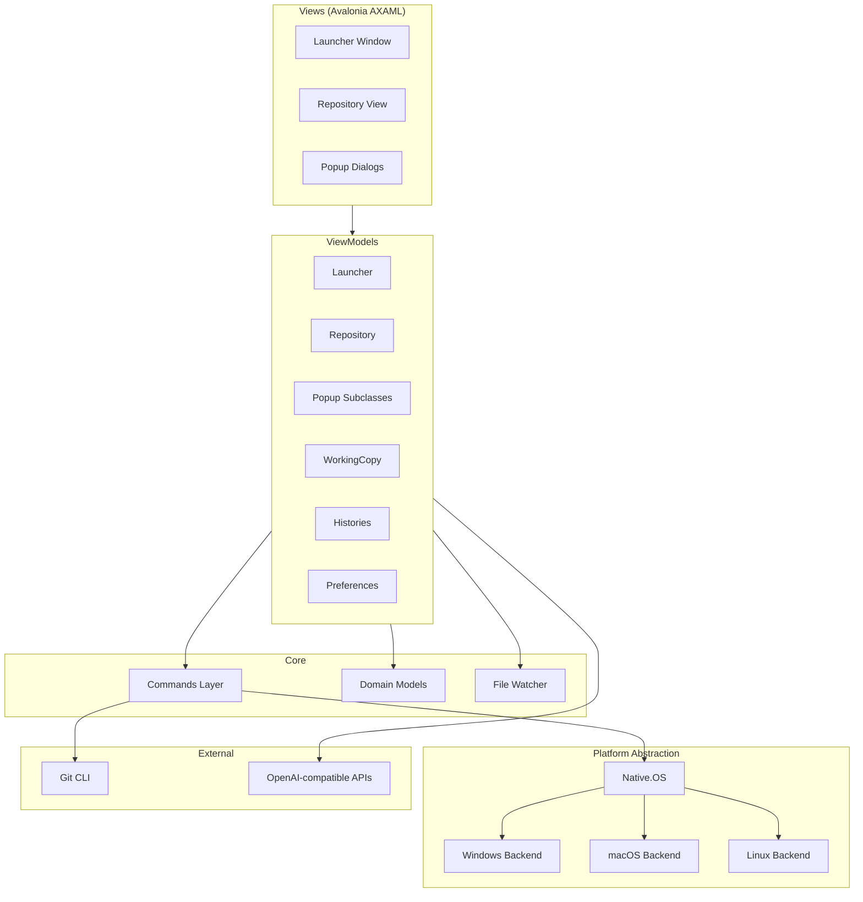

## Source Layout

```
src/
  App.axaml.cs            Application entry point and lifecycle
  App.Commands.cs          Global commands (open repo, etc.)
  App.JsonCodeGen.cs       Source-generated JSON serialization context
  Commands/                Git CLI wrappers (one class per operation)
  Converters/              XAML value converters
  Models/                  Domain data structures and interfaces
  Native/                  Platform abstraction (OS.cs + per-OS backends)
  Resources/               Fonts, icons, themes, locales, TextMate grammars
  ViewModels/              Application logic and UI state
  Views/                   Avalonia AXAML + code-behind
```

## MVVM Architecture

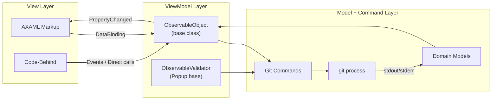

**Key conventions:**
- ViewModels inherit `ObservableObject` (CommunityToolkit.Mvvm)
- Popup ViewModels inherit `Popup` which extends `ObservableValidator` for form validation
- Views are matched to ViewModels via `App.CreateViewForViewModel()` and `PopupDataTemplates`
- Data flows: **View** <-> **ViewModel** -> **Command** -> **git process** -> parsed into **Models** -> ViewModel notifies View

## Application Lifecycle

### Startup Sequence

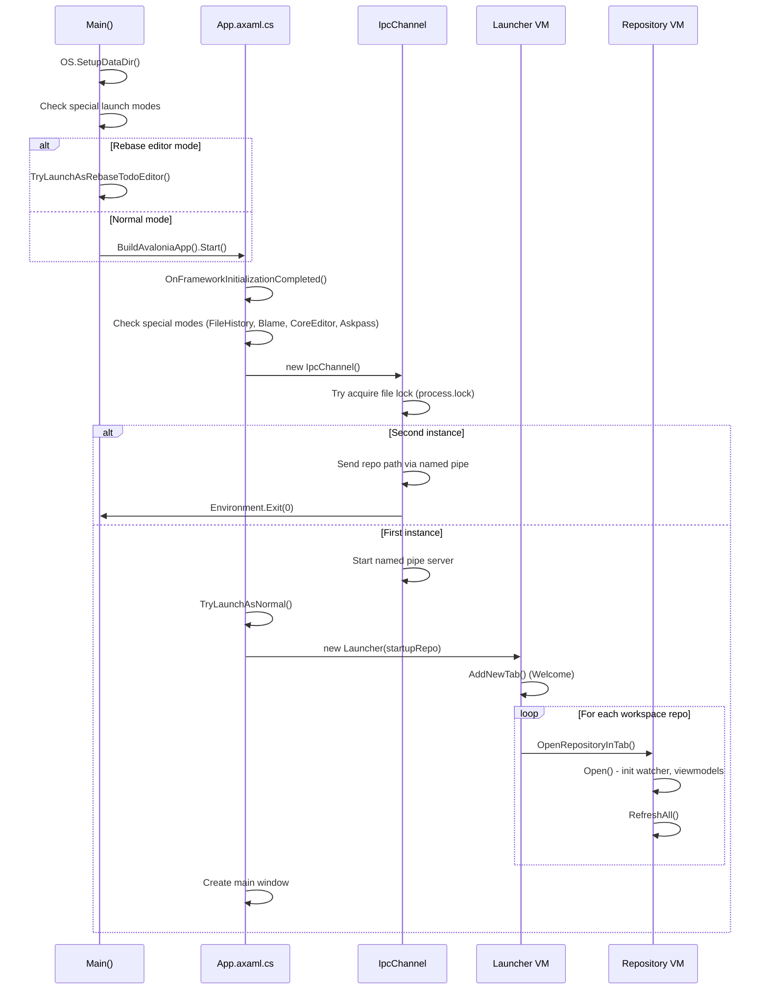

### Launch Modes

SourceGit supports multiple launch modes determined at startup:

| Mode | Trigger | Purpose |
|------|---------|---------|
| **Normal** | Default | Main GUI with tab-based repos |
| **Rebase Todo Editor** | `GIT_SEQUENCE_EDITOR` | Interactive rebase sequence editor |
| **Rebase Message Editor** | `core.editor` during rebase | Edit rebase commit messages |
| **File History Viewer** | CLI argument | Standalone file history window |
| **Blame Viewer** | CLI argument | Standalone blame window |
| **Core Editor** | `core.editor` | Commit message editor |
| **Askpass** | `SSH_ASKPASS` | Credential/password prompt |

### Singleton Enforcement

Only one SourceGit instance runs at a time:

1. First instance acquires an exclusive file lock on `<DataDir>/process.lock`
2. First instance starts a named pipe server: `SourceGitIPCChannel<username>`
3. Second instance detects the lock, sends the requested repository path over the pipe, and exits
4. First instance receives the path, opens the repository in a new tab, and brings the window to front

## Repository Management

### Tab System

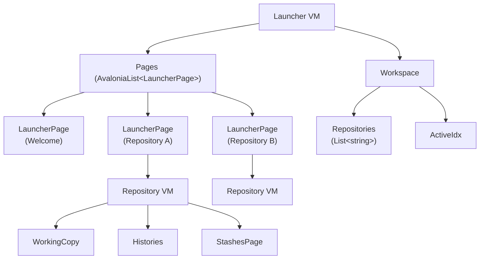

**Launcher** manages a collection of **LauncherPage** tabs. Each page holds either a **Welcome** screen or a **Repository** ViewModel.

**Workspace** tracks which repositories are open and the active tab index, enabling session restore on next startup. Multiple workspaces are supported with independent sets of open repositories.

### Repository Open/Close Lifecycle

**Opening:**
1. Validate path and check if already open (switch to existing tab if so)
2. Detect bare vs. normal repository, resolve `.git` directory
3. Create `Repository` ViewModel with paths
4. `repo.Open()`:
   - Load `RepositorySettings` and `RepositoryUIStates`
   - Start `Watcher` (FileSystemWatcher)
   - Initialize child ViewModels: `Histories`, `WorkingCopy`, `StashesPage`, `SearchCommitContext`
   - Start auto-fetch timer (5-second interval)
   - Call `RefreshAll()` to populate all data

**Closing:**
1. Cancel all pending `CancellationTokenSource` operations
2. Stop auto-fetch timer
3. Save UI state (commit message, expanded nodes, etc.)
4. Dispose watcher and all child ViewModels
5. Clear all data collections

## Git Command Execution

### Command Base Class

All git operations inherit from `Commands.Command`, which handles process spawning, output capture, and error handling.

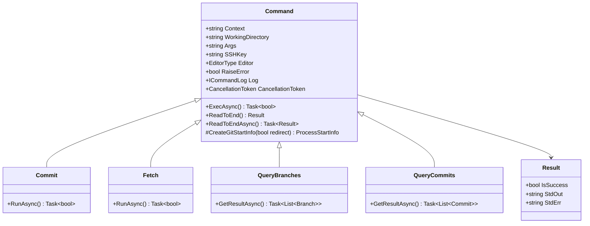

### Execution Patterns

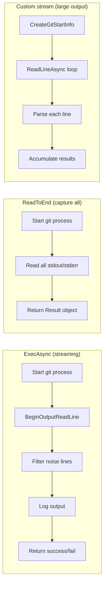

| Pattern | Method | Use Case | Examples |
|---------|--------|----------|---------|
| **Streaming** | `ExecAsync()` | Commands with progress, user interaction | Commit, Fetch, Push, Clone |
| **Full capture** | `ReadToEnd()` / `ReadToEndAsync()` | Small structured output for parsing | QueryBranches, Blame, Config |
| **Custom stream** | Manual `ReadLineAsync` loop | Large outputs parsed incrementally | QueryCommits (thousands of commits) |

### Process Configuration

`CreateGitStartInfo()` sets up the git process with:
- `GIT_SSH_COMMAND` with custom identity file (when SSH key is configured)
- `SSH_ASKPASS` pointing to SourceGit executable for credential prompts
- `core.editor` / `sequence.editor` for rebase operations
- `LANG=C` and `LC_ALL=C` on Linux for consistent output parsing
- `credential.helper` configuration
- Always includes `--no-pager -c core.quotepath=off`

## File Watcher & Auto-Refresh

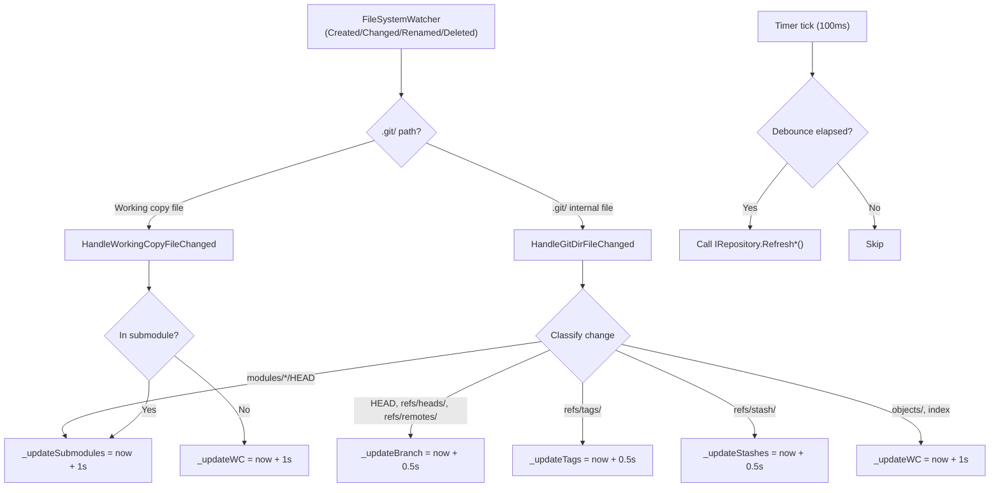

**Key design decisions:**

- **Debounced refresh**: Changes set a future timestamp (0.5s-1s ahead). The timer checks every 100ms whether the debounce period has elapsed before triggering a refresh. This coalesces rapid filesystem events into single refreshes.
- **Lock mechanism**: `Watcher.Lock()` returns a disposable `LockContext`. While any lock is held (e.g., during a git operation), the timer tick is suppressed to avoid stale reads during mutations.
- **Worktree support**: When the `.git` directory is separate from the working copy (worktrees), two separate FileSystemWatchers are used -- one for the working copy and one for the git directory.
- **Smart classification**: Git-internal file changes are classified to trigger only the relevant refresh (branches, tags, stashes, working copy, submodules). Files like `.lock` and `lfs/` are ignored.

## Platform Abstraction

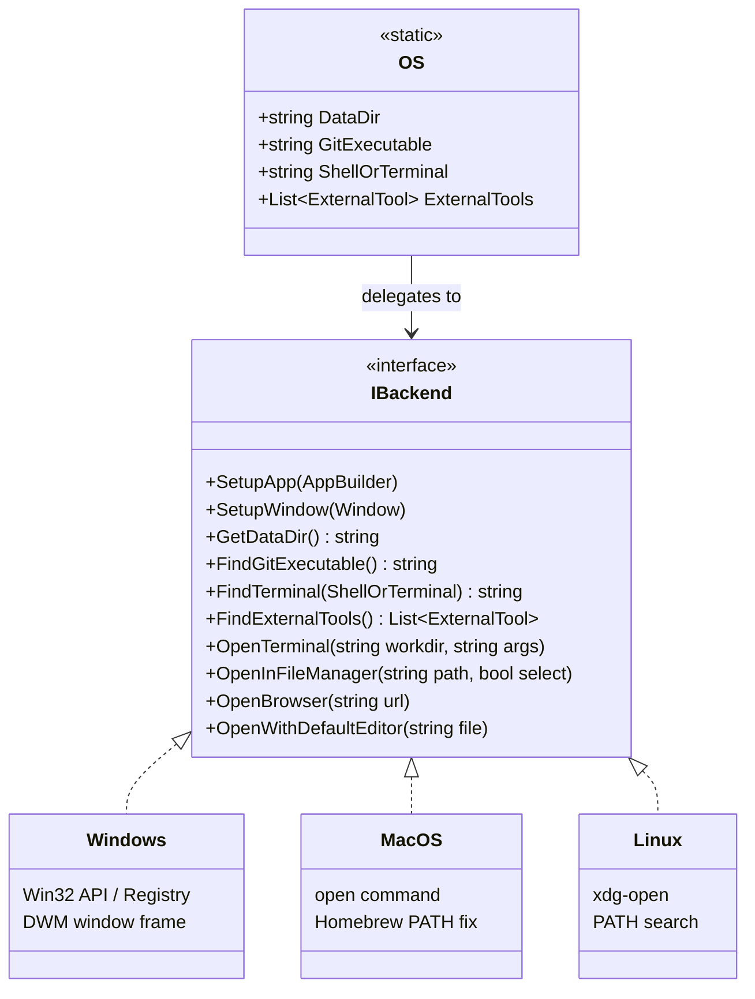

**Backend selection** happens in the `OS` static constructor using `OperatingSystem.IsWindows()` / `IsMacOS()` / `IsLinux()`.

| Capability | Windows | macOS | Linux |
|-----------|---------|-------|-------|
| **Data directory** | `%APPDATA%\SourceGit` (or portable) | `~/Library/Application Support/SourceGit` | `~/.sourcegit` (or AppImage portable) |
| **Find Git** | Registry + PATH | Hardcoded paths (`/usr/bin`, Homebrew) | PATH search |
| **Window frame** | Custom (DWM) | System chrome | Configurable |
| **File manager** | Shell32 API (`SHOpenFolderAndSelectItems`) | `open -R` | `xdg-open` |
| **External tools** | Registry + PATH | `.app` bundle paths | PATH search |

## UI Architecture

### Launcher Window & Tabs

The main window is `Views.Launcher`, data-bound to `ViewModels.Launcher`.

```
Launcher Window
  +-- Tab bar (one tab per LauncherPage)
  |     +-- Welcome tab (default)
  |     +-- Repository tabs (one per open repo)
  +-- Active page content area
  |     +-- Welcome: recent repos, clone, open
  |     +-- Repository: sidebar + main content
  +-- Popup overlay (modal dialogs)
  +-- Notification area
```

### Popup System

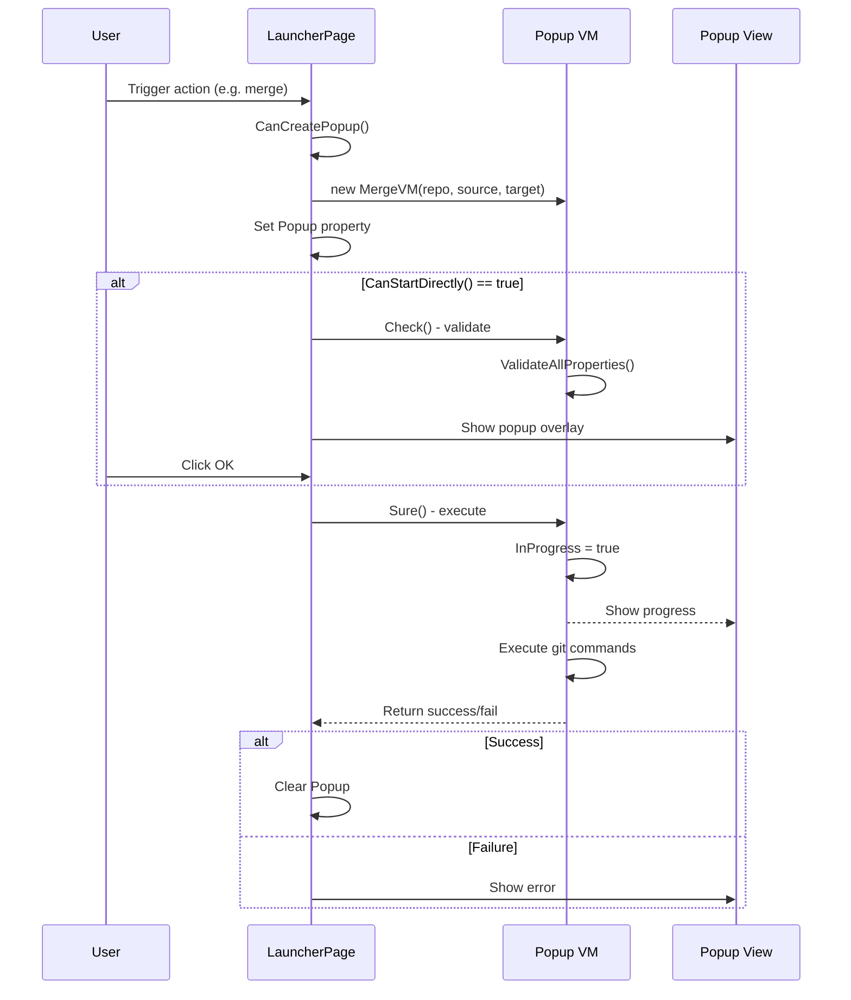

The **Popup** base class (`ViewModels.Popup`) provides:
- `Check()` -- runs `ObservableValidator` validation on all properties
- `Sure()` -- async method overridden by subclasses to perform the actual operation
- `CanStartDirectly()` -- when true, the popup executes immediately without showing a form
- `InProgress` / `ProgressDescription` -- bound to progress UI
- `ICommandLogReceiver` -- receives real-time git command output

**View resolution**: `PopupDataTemplates` implements `IDataTemplate`, matching any `ViewModels.Popup` instance to its corresponding View via `App.CreateViewForViewModel()`.

### Theme & Locale System

- **Themes**: Built-in `Default` and `Dark` themes loaded from `Resources/Themes/`. Theme overrides can be applied from a custom JSON file (`ThemeOverrides`).
- **Locales**: AXAML resource dictionaries in `Resources/Locales/`. English (`en_US.axaml`) is the base. Locale is changed at runtime via `App.SetLocale()` which swaps the resource dictionary.
- **Fonts**: Default and monospace font families are configurable. Applied via `App.SetFonts()`.

## Commit Graph Rendering

The commit graph (branch/merge visualization) uses a custom rendering pipeline:

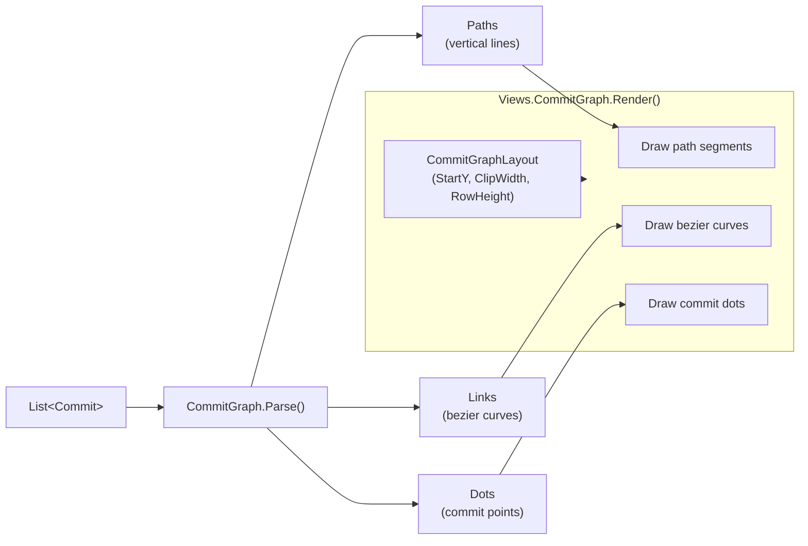

**`Models.CommitGraph.Parse()`** processes commits into drawable primitives:
- **Paths**: Vertical line segments connecting commits on the same branch (each path has a color index)
- **Links**: Bezier curves connecting merge parents / branch points (Start, Control, End points)
- **Dots**: Commit points with types (`Default`, `Head`, `Merge`) and position

**`Views.CommitGraph`** is a custom Avalonia `Control` that overrides `Render()` to draw directly using `DrawingContext`:
- Uses pre-computed `Pen` objects from a configurable color palette
- Clips rendering to the visible viewport via `CommitGraphLayout`
- Supports dimming non-current-branch paths (`OnlyHighlightCurrentBranch`)

## AI Integration

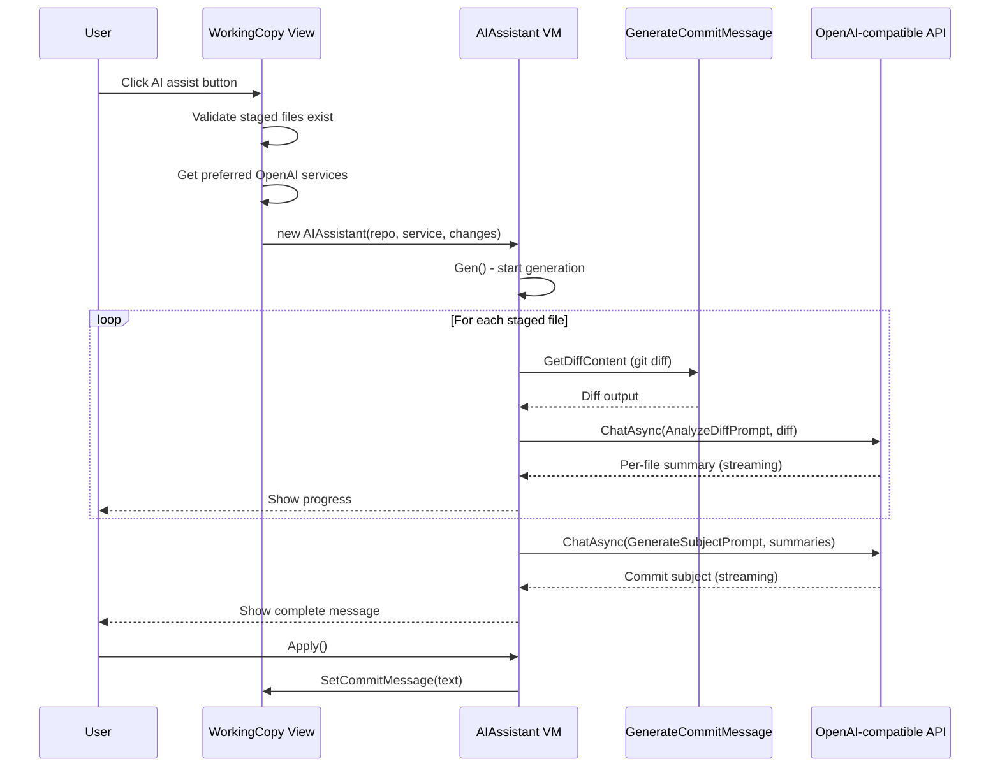

**Two-phase generation**:
1. **Analyze**: Each staged file's diff is sent individually with `AnalyzeDiffPrompt` to get per-file summaries
2. **Synthesize**: All summaries are combined and sent with `GenerateSubjectPrompt` to generate the commit subject line

The `OpenAIService` model supports any OpenAI-compatible API endpoint (OpenAI, Azure OpenAI, Ollama, etc.). Configuration includes: server URL, API key, model name, and custom prompts.

## Data Persistence

### Settings Architecture

```mermaid
graph TB
    subgraph Global["Global (per-user)"]
        Prefs["Preferences\n(preferences.json)"]
    end

    subgraph PerRepo["Per-Repository"]
        RepoSettings["RepositorySettings\n(.sourcegit/settings.json)"]
        UIStates["RepositoryUIStates\n(.sourcegit/ui_states.json)"]
    end

    Prefs --> Theme[Theme / Locale / Fonts]
    Prefs --> Git[Git executable / Credential helper]
    Prefs --> Tools[External tools / Terminals]
    Prefs --> Workspaces["Workspaces\n(open repos, active tab)"]
    Prefs --> RepoNodes["Repository nodes\n(tree structure)"]
    Prefs --> AIConfig[OpenAI service configs]

    RepoSettings --> CommitTemplates[Commit templates]
    RepoSettings --> IssueTrackers[Issue tracker rules]
    RepoSettings --> CommitHistory[Recent commit messages]
    RepoSettings --> CustomActions[Custom actions]

    UIStates --> Filters[Branch/tag filters]
    UIStates --> HistoryFlags[History display flags]
    UIStates --> LastCommitMsg[Last commit message]
```

| Store | Location | Scope | Serialization |
|-------|----------|-------|---------------|
| **Preferences** | `<DataDir>/preferences.json` | Global | Source-generated `System.Text.Json` |
| **RepositorySettings** | `<GitCommonDir>/.sourcegit/settings.json` | Per-repo | Source-generated `System.Text.Json` |
| **RepositoryUIStates** | `<GitDir>/.sourcegit/ui_states.json` | Per-worktree | Source-generated `System.Text.Json` |

All serialization uses `JsonCodeGen` (source-generated `JsonSerializerContext`) for AOT compatibility and performance. Custom converters handle `Color`, `GridLength`, and `DataGridLength` types.
